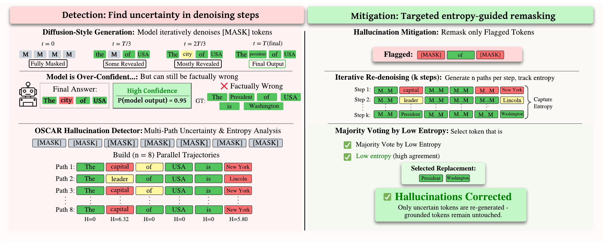
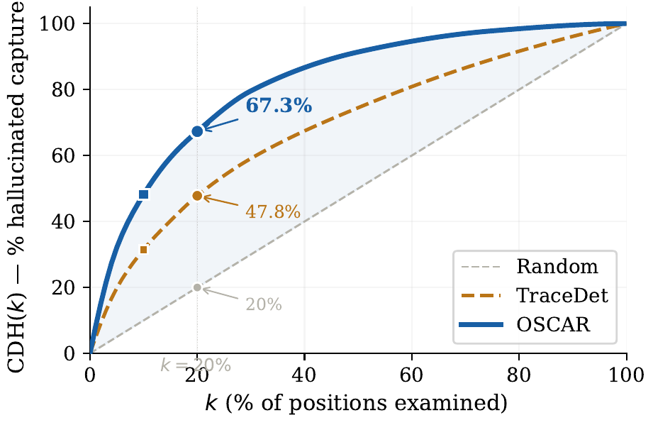
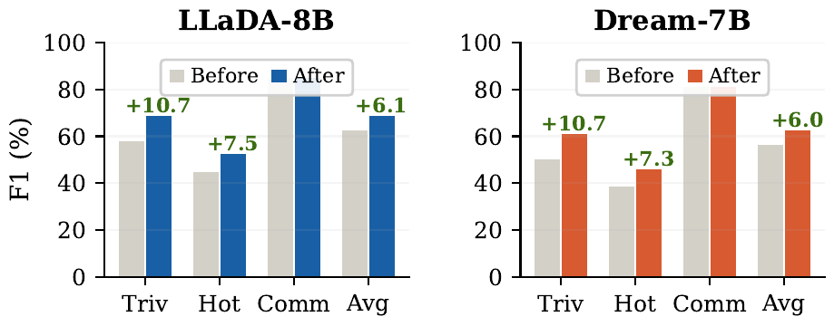
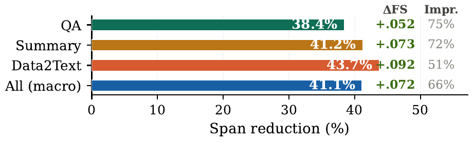
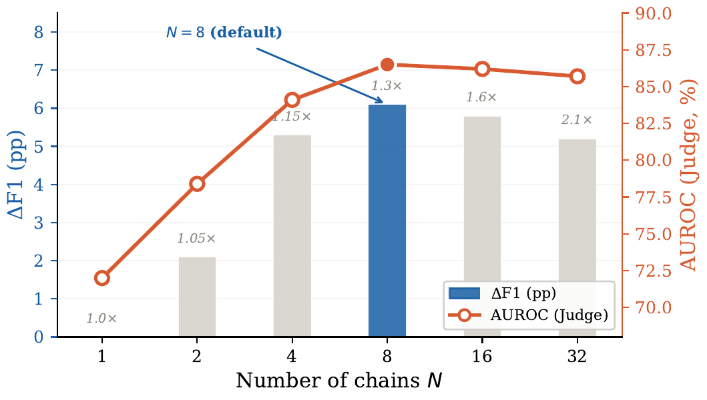

# OSCAR: Orchestrated Self-verification and Cross-path Refinement

**COLM 2026** · Arizona State University · University at Buffalo, SUNY

*Yash Shah, Abhijit Chakraborty, Naresh Kumar Devulapally, Vishnu Lokhande, Vivek Gupta*

[[Paper]](https://arxiv.org/abs/2604.01624) [[PDF]](https://arxiv.org/pdf/2604.01624) [[Poster]](Paper/OSCAR_COLM2026_poster_final.pdf)

---

OSCAR detects and corrects hallucinations in diffusion language models (DLMs) by running multiple parallel denoising chains and using cross-path disagreement as an uncertainty signal — no training, no labels required.

## Motivation

Diffusion language models generate text by iteratively unmasking tokens over many steps. Because each committed token influences all future steps, a single early hallucination can cascade: the model becomes internally consistent around a wrong fact and produces fluent but false output.

Existing DLM hallucination detectors (TraceDet, DynHD) are trained classifiers that flag errors but cannot fix them. SelfCheckGPT-style methods resample entire answers, discarding the structured uncertainty information available at every denoising step.

**Key insight:** Run several chains with different token-reveal orders from the same masked start. When the chains disagree on a position, the model is uncertain — and that position is likely hallucinated.

## The OSCAR Pipeline

<p align="center">
  
</p>

**Step 1 — Parallel decoding.** Run *K* denoising chains from the same masked input, each revealing tokens in a different (random) order. All chains share model weights and run in one batched pass.

**Step 2 — Detection.** At each token position, measure Shannon entropy across the *K* final outputs. Flag the top-20% highest-entropy positions and group neighbors into contiguous spans.

**Step 3 — Correction.** Remask only the flagged spans. Run a short targeted denoising pass conditioned on the retrieved source passage to re-generate those positions with grounding.

No training. No labels. Correction touches roughly 1-in-*K* tokens. Full run takes ~1.3× longer than a single chain.

---

## Detection

The entropy signal from parallel chains concentrates strongly at hallucinated positions.

<p align="center">
  
</p>

At the top-20% threshold, OSCAR captures **67.3%** of all annotated hallucination tokens — versus 47.8% for TraceDet and 20% for a random baseline. The shaded area is the gap OSCAR opens over TraceDet.

When scored end-to-end with an LLM judge, OSCAR achieves **86.5 AUROC** on LLaDA-8B and **85.7** on Dream-7B, outperforming all trained detectors without any supervision.

**Implementation:** `strategies/parallel_remask.py::compute_disagreement()`

```python
from strategies.parallel_remask import compute_disagreement

report = compute_disagreement(
    result,           # ParallelPathResult from run_parallel_paths()
    top_k_percent=0.20,
)
# report.high_entropy_positions  — flagged token indices
# report.token_entropy           — per-token entropy tensor
```

---

## Correction

Remasking the flagged spans and re-denoising with source conditioning consistently improves factuality across both models and all three benchmarks.

<p align="center">
  
</p>

Average improvement: **+6.1 F1** on LLaDA-8B and **+6.0 F1** on Dream-7B (macro-average across TriviaQA, HotpotQA, CommonsenseQA).

RAGTruth span-level results:

<p align="center">
  
</p>

Hallucination span reduction reaches **41.1%** macro-average across RAGTruth task types (+0.072 FactScore).

**Implementation:** `strategies/parallel_remask.py::random_remask_and_refine()`

```python
from strategies.parallel_remask import random_remask_and_refine

refinement = random_remask_and_refine(
    harness=harness,
    result=result,
    report=report,
    source_info=sample.source_info,  # retrieved passage for grounding
)
# refinement.refined_tokens   — corrected token sequence
# refinement.n_remasked       — number of positions re-denoised
```

---

## N-chains Ablation

<p align="center">
  
</p>

N=8 is the Pareto-optimal choice: it achieves the best ΔF1 (+6.1 pp) at only 1.3× the wall-clock cost of a single chain. AUROC continues to improve slightly beyond N=8 but at diminishing returns with growing overhead (1.6× at N=16, 2.1× at N=32).

---

## Repository Structure

```text
oscar/
├── run_experiment.py          # Main entry point: full Detection + Correction pipeline
├── oscar_eval.py              # LLM judge utilities (AUROC, bootstrap CIs, kappa)
├── oscar_judge_runner.py      # GPT-4o / Anthropic judge runner with caching
├── generate_oscar_figure_data.py  # Regenerate figure data from results
│
├── data/
│   └── ragtruth_loader.py     # RAGTruth dataset loader (HF hub or local files)
│
├── models/
│   ├── llada_harness.py       # LLaDA-8B wrapper: parallel chains, demasking orders
│   ├── dream_harness.py       # Dream-7B wrapper (legacy)
│   └── dream_harness_native.py # Dream-7B via diffusion_generate()
│
├── strategies/
│   └── parallel_remask.py     # DETECTION: compute_disagreement()
│                              # CORRECTION: random_remask_and_refine()
│
├── eval/
│   ├── metrics.py             # Token F1, FactScore, Spearman ρ, refinement delta
│   ├── unified_judge.py       # Unified judge evaluation (AUROC, bootstrap, kappa)
│   ├── h1_analysis.py         # H1 hypothesis analysis
│   └── h1_analysis_nli.py     # H1 with NLI backbone
│
├── scripts/
│   ├── run_all.sh             # End-to-end pipeline: full experiment + ablation
│   ├── run_all_experiments.sh # Extended suite: all paper experiments
│   ├── run_detection_auroc.py # Detection AUROC sweep
│   ├── run_npaths_ablation.py # N-paths sweep (1, 2, 4, 8, 16)
│   ├── c1_fair_auroc_judge.py # Fair AUROC: LLM judge on all baselines
│   ├── c3_crystallization.py  # When do hallucinations crystallize?
│   ├── c5_selfcheck_dlm.py    # SelfCheckGPT-DLM baseline
│   └── summarize_results.py   # Aggregate metrics across runs
│
├── tests/                     # CPU-safe unit tests (no GPU required)
├── docs/
│   ├── reproducibility.md     # Environment and reporting checklist
│   └── artifact_checklist.md  # Release checklist
├── figure_data/               # Pre-computed data for paper figures
└── Paper/
    ├── OSCAR_COLM2026_poster_final.pdf
    ├── oscar_pipeline_final.png
    ├── pipeline_teaser.png
    ├── figure_cdh.png
    ├── figure_generation.png
    ├── figure_nchains.png
    └── figure_ragtruth.png
```

---

## Getting Started

### Requirements

- Python ≥ 3.10
- GPU with ≥ 40 GB VRAM recommended (4 parallel paths at `gen_len=128` on LLaDA-8B)
- LLaDA-8B-Instruct or Dream-v0-Instruct-7B checkpoint (downloaded locally)

### Install

```bash
git clone https://github.com/Abhijit85/dllm-hallucination
cd dllm-hallucination

# Automated setup (checks Python, CUDA, installs deps)
bash setup_env.sh --model_path /path/to/LLaDA-8B-Instruct

# Or manually:
python -m venv .venv
source .venv/bin/activate
pip install -e ".[dev]"          # CPU + dev tools
pip install -e ".[gpu]"          # + bitsandbytes for quantized runs
```

### Model Download

```bash
# LLaDA-8B-Instruct (primary)
huggingface-cli download GSAI-ML/LLaDA-8B-Instruct --local-dir /your/model/path

# Dream-v0-Instruct-7B (secondary, for cross-model results)
huggingface-cli download Dream-org/Dream-v0-Instruct-7B --local-dir /your/model/path

# Point the harness to your local path:
export LLADA_MODEL_PATH=/your/model/path/LLaDA-8B-Instruct
```

### Dataset

RAGTruth is loaded automatically from the Hugging Face hub (`wanderkid/RAGTruth`) when no `--data_path` is provided. To use a local copy:

```bash
# Local directory layout expected:
# ragtruth/
#   response.jsonl
#   source_info.jsonl
export RAGTRUTH_DATA_PATH=/your/local/ragtruth/dataset
```

### Run Tests (CPU, no GPU required)

```bash
pytest tests/ -m "not gpu" -v
```

---

## Reproducing Paper Results

### Quick smoke test (~2 min, CPU-only)

Verifies the pipeline initializes and completes end-to-end on a tiny sample without a real model:

```bash
pytest tests/ -m "not gpu" -v
```

### Detection + Correction — full pipeline

```bash
# Standard run: 8 paths, 500 QA samples
python run_experiment.py \
    --model_id "$LLADA_MODEL_PATH" \
    --data_path "$RAGTRUTH_DATA_PATH" \
    --n_paths 8 \
    --num_steps 64 \
    --max_samples 500 \
    --task_type QA \
    --seed 42 \
    --output_dir results/oscar_main
```

### N-paths ablation

```bash
python scripts/run_npaths_ablation.py \
    --model_id "$LLADA_MODEL_PATH" \
    --data_path "$RAGTRUTH_DATA_PATH" \
    --n_paths_list 1 2 4 8 16 \
    --num_steps 64 \
    --max_samples 100 \
    --output_root results/ablation_npaths
```

### Detection AUROC sweep

```bash
python scripts/run_detection_auroc.py \
    --model_path "$LLADA_MODEL_PATH" \
    --dataset triviaqa \
    --n_samples 500 \
    --n_paths 8 \
    --num_steps 32 \
    --output results/auroc_triviaqa
```

### LLM-judge AUROC (requires OpenAI API key)

```bash
export OPENAI_API_KEY="sk-..."

python scripts/c1_fair_auroc_judge.py \
    --results_base results/ \
    --output results/c1_fair_auroc/ \
    --model gpt-4o \
    --max_concurrent 20
```

### Full experiment suite

```bash
export LLADA_MODEL_PATH=/path/to/LLaDA-8B-Instruct
export RAGTRUTH_DATA_PATH=/path/to/ragtruth/dataset
export OPENAI_API_KEY="sk-..."           # for C1 judge eval

bash scripts/run_all_experiments.sh      # full suite
bash scripts/run_all_experiments.sh --skip-gpu  # post-processing only
```

### Output files

Each experiment directory contains:

```text
results/
├── raw_results.jsonl      # per-sample metrics (detection + correction)
├── aggregate.json         # summary statistics for the run
└── threshold_ablation.json  # entropy threshold sweep (if --ablate_thresholds)
```

---

## Key Parameters

| Parameter | Default | Description |
|---|---|---|
| `--n_paths` | `8` | Number of parallel denoising chains |
| `--num_steps` | `64` | Denoising steps per chain |
| `--top_k_percent` | `0.20` | Flag top-K% highest-entropy tokens |
| `--min_refine_steps` | `16` | Minimum steps for correction pass |
| `--task_type` | `None` | RAGTruth task filter: `QA`, `Summary`, `Data2txt` |
| `--seed` | `42` | Base seed for path generation |

---

## Reproducibility

See [docs/reproducibility.md](docs/reproducibility.md) for the full checklist. Minimum fields to report:

| Field | How to capture |
|---|---|
| Git commit | `git rev-parse HEAD` |
| Python version | `python --version` |
| Model | `GSAI-ML/LLaDA-8B-Instruct` or `Dream-org/Dream-v0-Instruct-7B` |
| Dataset | `wanderkid/RAGTruth`, split `test` |
| Hardware | GPU model, VRAM, CUDA version |
| Command | Full `python run_experiment.py ...` invocation |

---

## Citation

```bibtex
@article{shah2026oscar,
  title   = {OSCAR: Orchestrated Self-verification and Cross-path Refinement},
  author  = {Shah, Yash and Chakraborty, Abhijit and Devulapally, Naresh Kumar
             and Lokhande, Vishnu and Gupta, Vivek},
  journal = {arXiv preprint arXiv:2604.01624},
  year    = {2026},
  doi     = {10.48550/arXiv.2604.01624},
  url     = {https://arxiv.org/abs/2604.01624},
}
```

---

## License

MIT License. See [LICENSE](LICENSE).
